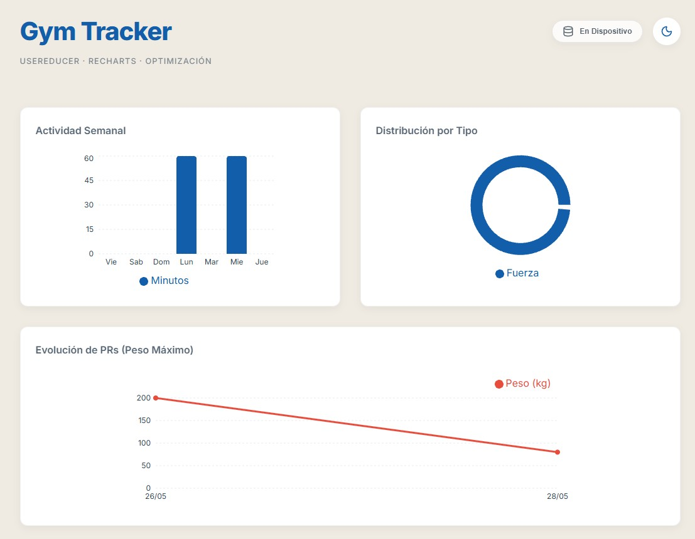
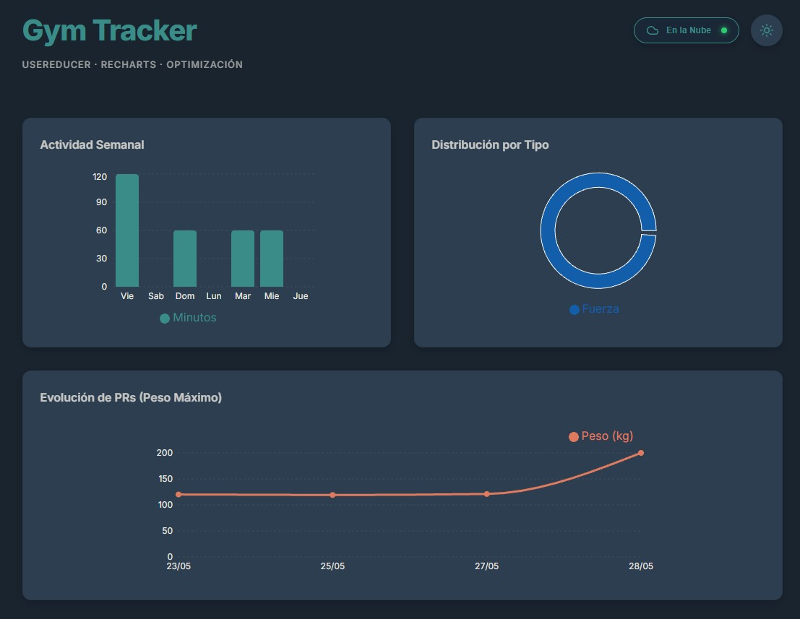
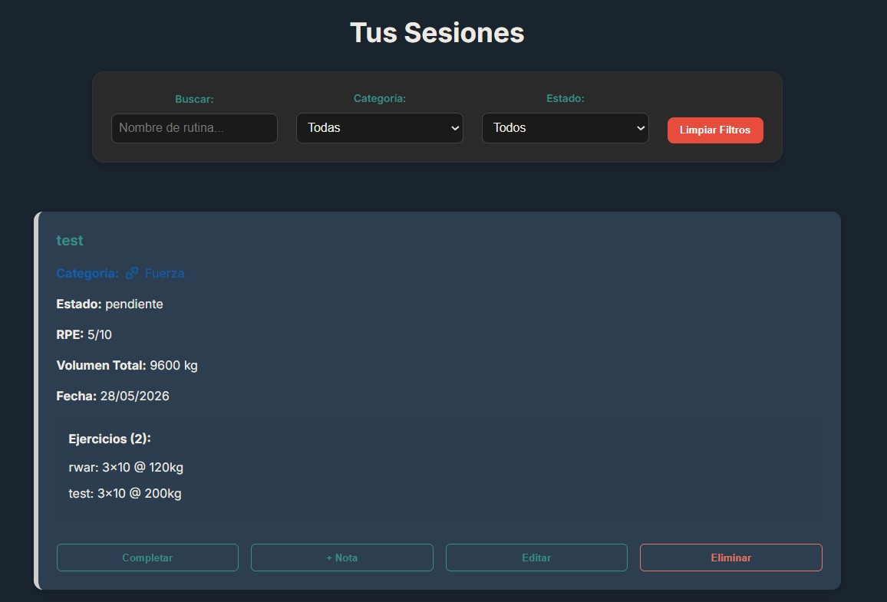

# Gym Tracker - Bitácora Personal (Fase 3 en progreso)
**UVG - Sistemas y Tecnologías Web**

Este es mi proyecto para el curso. Decidí hacer un tracker de gimnasio porque me sirve personalmente en mi día a día para llevar el control de lo que levanto en cada sesión, en lugar de anotarlo en el celular o en papel.

---

## Cambios en Fase 3 Extras

### Atajo de Teclado Actualizado
Cambié el atajo global de `Ctrl+N` a `Alt+N`. Me di cuenta de que al probarlo en Chrome, `Ctrl+N` siempre abría una pestaña nueva del navegador antes de que mi código pudiera atrapar el evento. Con `Alt+N` funciona perfecto y no choca con las funciones del sistema. Esto lo documenté porque es un cambio de UX para el usuario final (y para mí mientras lo uso).

---

## Lo que hice en la Fase 2
- **Atajos de Teclado:** Aparte de la `T` para el tema, puse `Alt+N` global para crear una nueva sesión rápido (limpia el form y te baja el scroll de una vez, manejado con `useEffect` y su respectivo cleanup).
- **Categorías y UI:** Añadí 5 categorías (Fuerza, Cardio, Resistencia, etc.). Todo con iconos `lucide-react` en lugar de emojis.

Link Video Demo Fase 2: https://uvggt-my.sharepoint.com/:v:/g/personal/lop231361_uvg_edu_gt/IQA2NwjzHqQNTZNpLN3ylJbsAZRa7Hc7JHHSy_LPOlqjiHw?nav=eyJyZWZlcnJhbEluZm8iOnsicmVmZXJyYWxBcHAiOiJPbmVEcml2ZUZvckJ1c2luZXNzIiwicmVmZXJyYWxBcHBQbGF0Zm9ybSI6IldlYiIsInJlZmVycmFsTW9kZSI6InZpZXciLCJyZWZlcnJhbFZpZXciOiJNeUZpbGVzTGlua0NvcHkifX0&e=133GYB

Link Video Demo Fase 3: https://uvggt-my.sharepoint.com/:v:/g/personal/lop231361_uvg_edu_gt/IQAPTvH7tJDuRKqEq2WM5rB-ARlisflWW9fiZbaDJZGq7jA?nav=eyJyZWZlcnJhbEluZm8iOnsicmVmZXJyYWxBcHAiOiJPbmVEcml2ZUZvckJ1c2luZXNzIiwicmVmZXJyYWxBcHBQbGF0Zm9ybSI6IldlYiIsInJlZmVycmFsTW9kZSI6InZpZXciLCJyZWZlcnJhbFZpZXciOiJNeUZpbGVzTGlua0NvcHkifX0&e=8XwxOm

---

## Lo que hice en la Fase 1

### Frontend
Armé la interfaz con **React y Vite**. Lo más importante es que las sesiones no se borran al recargar la página porque usé `LocalStorage`.
- El formulario permite agregar varios ejercicios a la misma sesión.
- Calculo el volumen total (sets x reps x peso) automáticamente.
- Dividí todo en componentes: `FormularioItem`, `ListaItems` e `ItemCard`.
- Agregué la funcionalidad de **Editar Sesión** para corregir datos antes de completarlas.

### Backend
Hice un servidor con **Express** que ya se conecta a **PostgreSQL**.
- Creé las tablas `items` (para las sesiones) y `registros`.
- Los 5 endpoints ya están programados y listos para recibir datos.

---

## Decisiones de Diseño (Fase 2)

**Iconos en vez de emojis:**
Las instrucciones pedían usar emojis para las categorías, pero decidí usar la librería `lucide-react` para los iconos. Siento que los emojis rompen la estética (crema y azul) que llevo hasta ahora. Toda la vibra visual, incluyendo la paleta de colores, la tomé inspirándome en **indoek.com** (una página de surf que vi en siteinspire). Por eso no usé el típico negro/rojo de gym, quería algo más chill.

---

## Capturas de mi progreso

Aquí se puede ver cómo quedó la interfaz y que ya la estoy probando con mis propios entrenamientos:

### Mis entrenamientos (Datos reales)

### Diseño de la App (Modern Theme)

### Tablas en PostgreSQL

### Progreso Fase 2 ya con temas y context

### Progreso Fase 3

---

## Cómo correr el proyecto

### Para el Backend:
1. Tener PostgreSQL instalado y una base de datos llamada `gym_tracker`.
2. Correr el script de `backend/src/db/init.sql`.
3. Crear un `.env` dentro de `backend/` con los datos de tu base de datos (puedes ver el `.env.example`).
4. `npm install` y luego `npm run dev`.

### Para el Frontend:
1. `cd frontend`
2. `npm install`
3. `npm run dev` y abrir el link de Localhost.

---

## Fase 3: useReducer, Recharts y Optimización

### 1. Mi Gráfica Original
**Evolución de PRs (Peso Máximo)**
- **Qué muestra:** Una gráfica de línea (`LineChart`) que ilustra cómo ha ido subiendo o bajando el peso máximo levantado a lo largo del tiempo (agrupado por fecha).
- **Por qué fue elegida:** En un gym tracker, el progreso progresivo es lo más importante. En vez de solo ver cuántos minutos entrené, lo que más me sirve en mi día a día es ver si mis levantamientos máximos (PRs).

### 2. Mis 3 Decisiones Técnicas

1. **Estructura del reducer:**
   Decidí estructurar el estado inicial no solo con la `lista` de sesiones, sino incluyendo ahí mismo el estado de los filtros (`filtroCategoria`, `filtroEstado`, `busqueda`). Esto me permitió tener una sola fuente de la verdad para todo el contexto visual de la app, y usar `useMemo` más limpio en base a ese estado único.

2. **Acción de Historial (`REGISTRAR_ACTIVIDAD`):**
   Para cumplir con el requisito de "agregar un registro de actividad al historial", implementé un sistema de notas acumulativas. El usuario puede presionar el botón "+ Nota" en cualquier sesión, lo que dispara un dispatch que concatena la nueva entrada al campo de `notas` existente, permitiendo llevar una bitácora detallada dentro de una misma rutina.

3. **Acción más difícil (`REGISTRAR_PR`):**
   Implica buscar la sesión por ID, luego iterar sobre sus ejercicios anidados, encontrar el ejercicio específico, cambiarle el peso, y finalmente **recalcular el volumen total** de toda la sesión (sets x reps x peso) sumando todos los ejercicios. Todo sin mutar el objeto original de la lista.

4. **Gráfica más compleja (Evolución PRs):**
   Fue la más compleja de procesar para `recharts` porque la data no venía plana. Tuve que iterar la `lista` de sesiones filtradas, luego iterar sus `atributos.ejercicios`, sacar el `Math.max` de peso, y agruparlo en un objeto temporal con la fecha como key, para finalmente ordenarlo cronológicamente y mapearlo al formato `{ date, val }` que necesita `LineChart`.

### 3. Profiler y Rendimiento (useMemo, useCallback y React.memo)

Al medir con React DevTools Profiler, la diferencia se nota muchísimo al escribir en la barra de búsqueda:

- **Antes de la optimización:** Por cada letra que tecleaba en el input, absolutamente toda la lista de `ItemCard`, los filtros y los cálculos de las gráficas se volvían a renderizar, lo que provocaba micro-tirones y un renderizado "amarillo/rojo" en el profiler.
- **Después de la optimización:** Como usé `useMemo` para calcular `itemsVisibles` y los datos de las gráficas, además de `React.memo` exportando el `ItemCard`, al escribir en el buscador los componentes de ItemCard individuales dejaron de re-renderizarse. Esto mejoró el rendimiento porque React ya no destruye y reconstruye el DOM de cada sesión guardada si sus props no cambiaron. Las funciones pasadas (como `onToggleStatus` o `onDelete`) ahora están estables gracias a `useCallback`, evitando que rompan el `React.memo`.

---