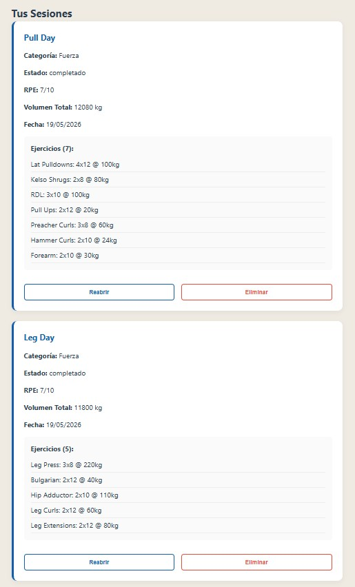
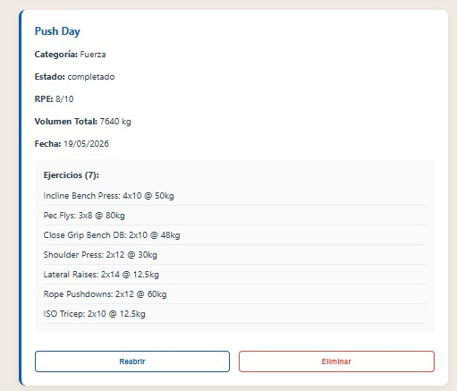
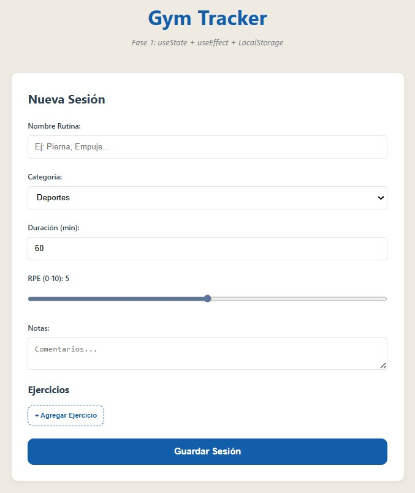
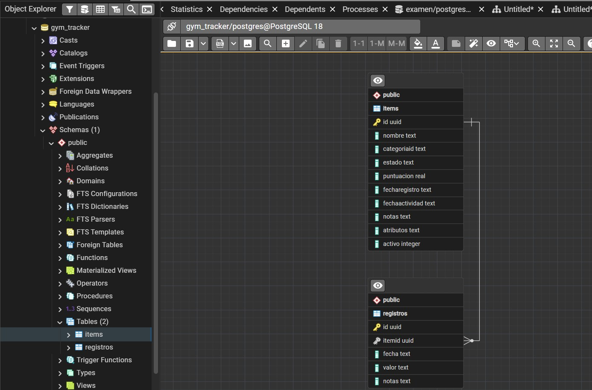
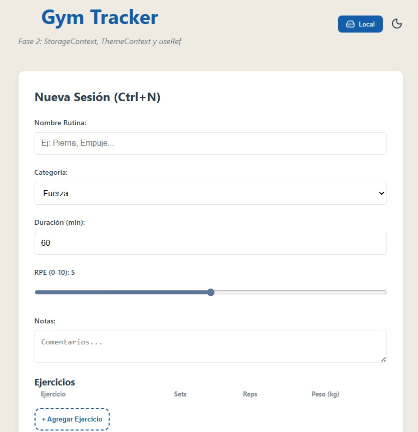
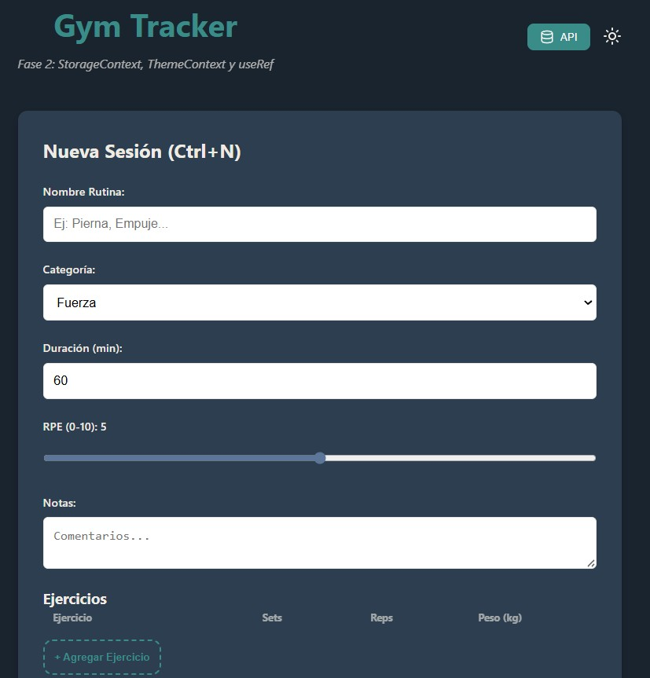

# Gym Tracker - Bitácora Personal (Fases 1 y 2)
**UVG - Sistemas y Tecnologías Web**

Este es mi proyecto para el curso. Decidí hacer un tracker de gimnasio porque me sirve personalmente en mi día a día para llevar el control de lo que levanto en cada sesión, en lugar de anotarlo en el celular o en papel.

---

## Lo que hice en la Fase 2

Para esta fase me enfoqué en usar el Context API y hooks más avanzados de React:
- **StorageContext:** Creé un contexto híbrido para abstraer si los datos vienen del LocalStorage o de la API (PostgreSQL). ¡El frontend ni se entera de dónde vienen los datos! Y le puse un switch en el header para cambiar de modo.
- **ThemeContext:** Agregué modo claro y oscuro con variables CSS. Se guarda en el localStorage para que no se pierda al recargar, y se puede cambiar rápido presionando la tecla `T`.
- **useRef al rescate:** Le metí 2 usos a `useRef`. Uno (`nombreInputRef`) para hacer auto-focus en el input de nombre al crear una sesión, y otro (`formRef`) para hacer scroll automático hasta el formulario.
- **Atajos de Teclado:** Aparte de la `T` para el tema, puse `Ctrl+N` global para crear una nueva sesión rápido (limpia el form y te baja el scroll de una vez, manejado con `useEffect` y su respectivo cleanup).
- **Categorías y UI:** Añadí 5 categorías (Fuerza, Cardio, Resistencia, etc.). Todo con iconos `lucide-react` en lugar de emojis.

Link Video Demo Fase 2: 

<video controls src="https://uvggt-my.sharepoint.com/:v:/r/personal/lop231361_uvg_edu_gt/Documents/Web/Fase2ProyFinal.mp4?csf=1&web=1&nav=eyJyZWZlcnJhbEluZm8iOnsicmVmZXJyYWxBcHAiOiJPbmVEcml2ZUZvckJ1c2luZXNzIiwicmVmZXJyYWxBcHBQbGF0Zm9ybSI6IldlYiIsInJlZmVycmFsTW9kZSI6InZpZXciLCJyZWZlcnJhbFZpZXciOiJNeUZpbGVzTGlua0NvcHkifX0&e=wQQpKf" title="Title"></video>

---

## Lo que hice en la Fase 1

### Frontend
Armé la interfaz con **React y Vite**. Lo más importante es que las sesiones no se borran al recargar la página porque usé `LocalStorage`.
- El formulario permite agregar varios ejercicios a la misma sesión.
- Calculo el volumen total (sets x reps x peso) automáticamente.
- Dividí todo en componentes: `FormularioItem`, `ListaItems` e `ItemCard`.
- Agregué la funcionalidad de **Editar Sesión** para corregir datos antes de completarlas.

### Backend
Hice un servidor con **Express** que ya se conecta a **PostgreSQL**.
- Creé las tablas `items` (para las sesiones) y `registros`.
- Los 5 endpoints ya están programados y listos para recibir datos.

---

## Decisiones de Diseño (Fase 2)

**Iconos en vez de emojis:**
Las instrucciones pedían usar emojis para las categorías, pero decidí usar la librería `lucide-react` para los iconos. Siento que los emojis rompen la estética (crema y azul) que llevo hasta ahora. Toda la vibra visual, incluyendo la paleta de colores, la tomé inspirándome en **indoek.com** (una página de surf que vi en siteinspire). Por eso no usé el típico negro/rojo de gym, quería algo más chill.

---

## Capturas de mi progreso

Aquí se puede ver cómo quedó la interfaz y que ya la estoy probando con mis propios entrenamientos:

### Mis entrenamientos (Datos reales)

### Diseño de la App (Modern Theme)

### Tablas en PostgreSQL

### Progreso Fase 2 ya con temas y context

---

## Cómo correr el proyecto

### Para el Backend:
1. Tener PostgreSQL instalado y una base de datos llamada `gym_tracker`.
2. Correr el script de `backend/src/db/init.sql`.
3. Crear un `.env` dentro de `backend/` con los datos de tu base de datos (puedes ver el `.env.example`).
4. `npm install` y luego `npm run dev`.

### Para el Frontend:
1. `cd frontend`
2. `npm install`
3. `npm run dev` y abrir el link de Localhost.
