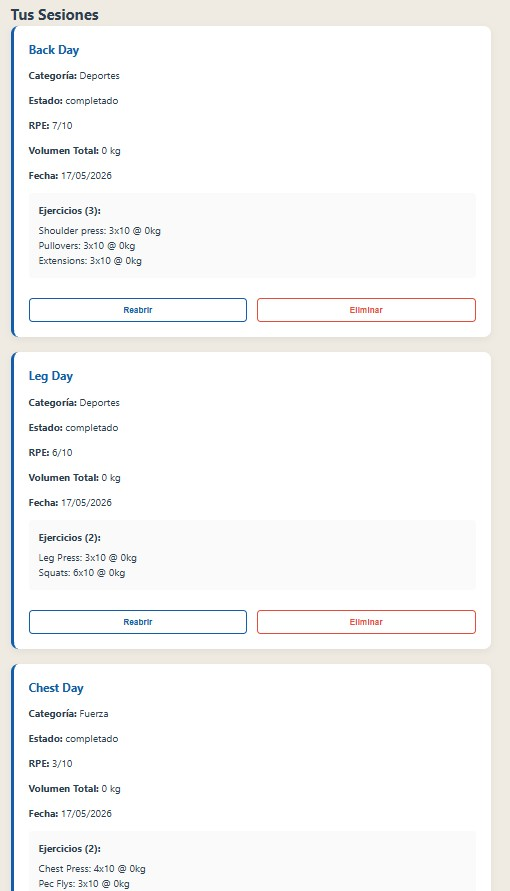
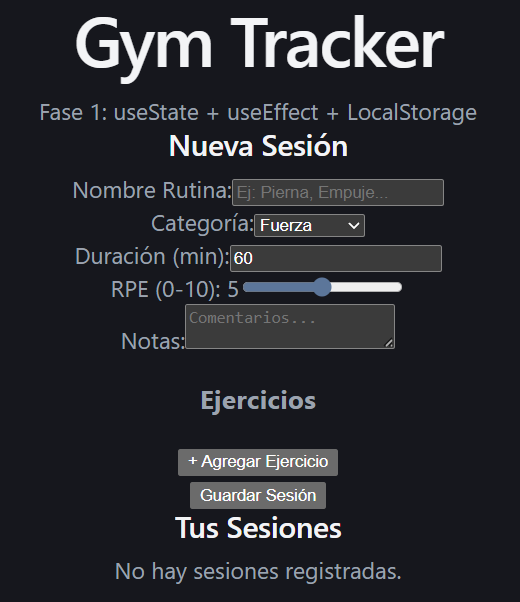

# Gym Tracker - Bitácora Personal (Fase 1)
**UVG 231361 - Sistemas y Tecnologías Web**

Este es mi proyecto para la primera fase. Decidí hacer un tracker de gimnasio porque realmente me sirve en la vida real. Siempre he buscado una opción (sin estar dispuesto a pagar) para llevar el control de lo que levanto en cada sesión, cuanto peso, cuantos sets, cuantas reps, esfuerzo, etc. En lugar de anotarlo en el celular o en papel que después uno ni revisa esos apuntes ni los evalúa. Con una app que no solo haga eso sino que lo evalúe y de resumenes por sesión, por semana, por periodo de tiempo custom. Sería perfecto.

Esta fase simplemente se enfoca en que el frontend guarde todo en el navegador y que el backend ya tenga las tablas listas para cuando nos toque conectarlos en la Fase 2.

---

## Lo que hice en esta Fase

### Frontend
Armé la interfaz con **React y Vite**. Lo más importante es que las sesiones no se borran al recargar la página porque usé `LocalStorage`.
- El formulario permite agregar varios ejercicios a la misma sesión.
- Calculo el volumen total (sets x reps x peso) automáticamente.
- Dividí todo en componentes: `FormularioItem`, `ListaItems` e `ItemCard`.

### Backend
Hice un servidor con **Express** que ya se conecta a **PostgreSQL**.
- Creé las tablas `items` (para las sesiones) y `registros`.
- Los 5 endpoints ya están programados y listos para recibir datos.

---

## Capturas de mi progreso

Aquí se puede ver cómo quedó la interfaz y que ya la estoy probando con mis propios entrenamientos:

### Mis primeros entrenamientos (Datos reales)

### Diseño de la App

### Tablas en PostgreSQL

---

## Cómo correr el proyecto

### Para el Backend:
1. Tener PostgreSQL instalado y una base de datos llamada `gym_tracker`.
2. Correr el script de `backend/src/db/init.sql`.
3. Crear un `.env` dentro de `backend/` con los datos de tu base de datos (puedes ver el `.env.example`).
4. `npm install` y luego `npm run dev`.

### Para el Frontend:
1. `cd frontend`
2. `npm install`
3. `npm run dev` y abrir el link de Localhost.
