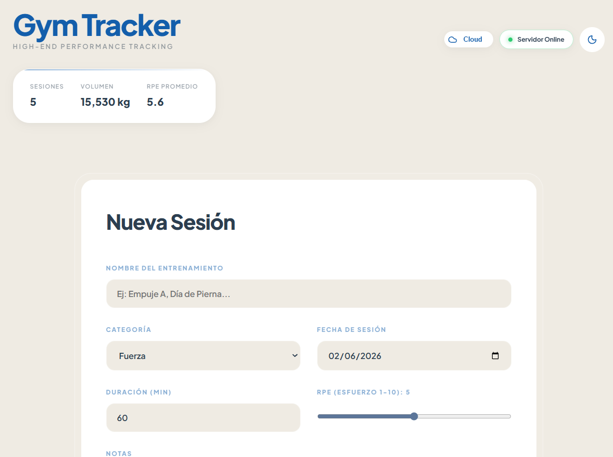
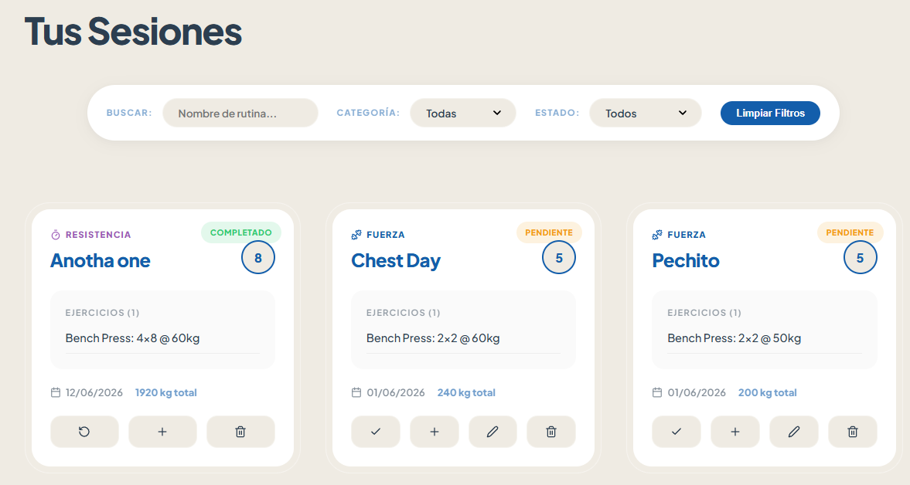
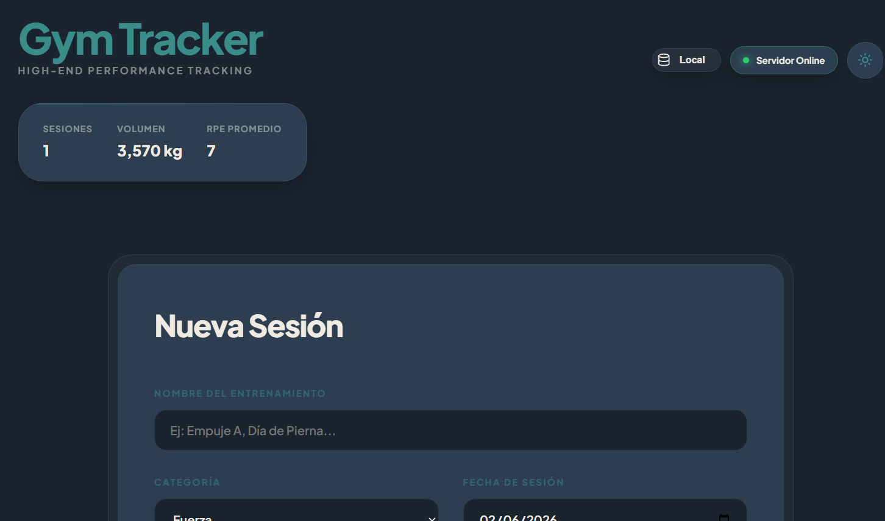
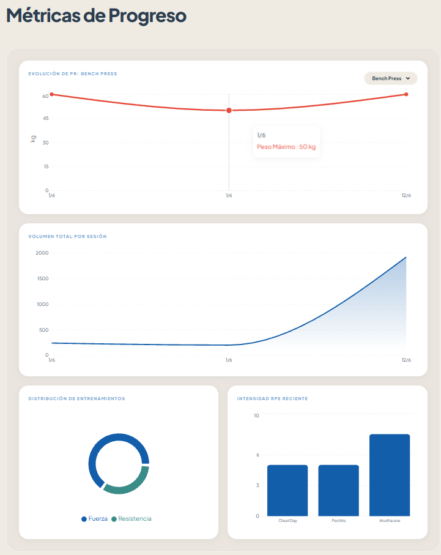

# Gym Tracker - High-End Performance Tracking 🏋️‍♂️

## 1. Enlaces de Producción
- **Frontend (Vercel):** `https://proyecto-web-final-three.vercel.app/`
- **Backend (Render):** `https://gym-tracker-backend-7ght.onrender.com/health`

Link de Video Demo y PR: 

## 2. Capturas de Pantalla
En cada branch el readme incluye screens del progreso de cada fase. Este final ya solamente incluye de la versión final.
- **Modo Claro y Cloud:**  
  
- **Sesiones:**  
  
- **Modo Oscuro y Local:**  
  
- **Gráficas:**  
  

## 3. Stack Tecnológico (Tech Stack)
### Frontend
- **Framework:** React 18 con TypeScript y Vite (Rendimiento optimizado).
- **Estilos:** CSS Puro de Alta Fidelidad (Double-Bezel architecture, CSS Variables para temas).
- **Gráficas:** Recharts (SVG responsivo).
- **Iconos:** Lucide-React.

### Backend
- **Framework:** Node.js con Express.
- **Seguridad:** CORS dinámico configurado para el entorno de producción.
- **Persistencia:** (Simulada/Preparada para DB).

## 4. Configuración Local (Local Setup)

Para correr este proyecto en tu máquina local:

**Clonar el repositorio:**
```bash
git clone https://github.com/tu-usuario/proywebfinal.git
cd proywebfinal
```

**1. Levantar el Backend:**
```bash
cd backend
npm install
npm run dev
# El servidor correrá en http://localhost:3000
```

**2. Levantar el Frontend:**
```bash
cd frontend
npm install
npm run dev
# La app correrá en http://localhost:5173
```

## 5. Mis Primeros Items (Datos Reales)
Ejemplos de sesiones de entrenamiento reales registradas en la aplicación:
1. **Día de Pierna Pesado:** Categoría: Fuerza. Ejercicios: Squat (3x8 @ 100kg), Prensa (3x10 @ 150kg). RPE: 8.5.
2. **Cardio HIIT:** Categoría: Resistencia. Ejercicios: Sprint en cinta (10x1min). Duración: 30 min. RPE: 9.
3. **Empuje (Pecho/Tríceps):** Categoría: Fuerza. Ejercicios: Bench Press (4x6 @ 80kg), Dips (3x12 @ 20kg). RPE: 7.5.

## 6. Mi Paleta de Colores y UI (Justificación)
El diseño sigue una estética de agencia "High-End" (Steel & Blue), utilizando arquitectura *Double-Bezel* para dar profundidad táctil (haptic depth) sin usar librerías externas de UI.

| Color | HEX | Uso y Justificación |
| :--- | :--- | :--- |
| **Primary Blue** | `#135eab` | Color de acento principal. Transmite confianza, energía y limpieza técnica. |
| **Background Light** | `#efebe3` | Tono off-white/crema. Reduce la fatiga visual comparado con un blanco puro (#FFF). |
| **Dark Surface** | `#1a242f` | Gris carbón con matiz azul para el modo oscuro. Elegante y legible. |
| **Teal (Flexibilidad)** | `#3a8c88` | Usado para categorías específicas, da un toque orgánico y calmado. |

## 7. Decisiones Técnicas de Gráficas (Recharts)
Se implementó un Dashboard de Métricas cohesivo en la parte inferior:
- **Line Chart (Evolución de PR):** Permite filtrar por un ejercicio específico y ver la evolución del peso máximo (PR) a lo largo del tiempo. Es la métrica más importante de fuerza.
- **Area Chart (Volumen Total):** Muestra la suma total de kilos levantados por sesión. El área debajo de la curva ayuda a visualizar la carga de trabajo acumulada.
- **Pie Chart (Distribución):** Visualiza la proporción de categorías (Fuerza, Cardio, etc.) para identificar si el entrenamiento está balanceado.
- **Bar Chart (RPE):** Un gráfico de barras estricto del 1 al 10 para medir la intensidad y fatiga percibida en las últimas sesiones.

## 8. Rendimiento y Optimización
Se utilizaron técnicas estrictas de renderizado en React para evitar cálculos innecesarios:
- **`useMemo`:** Se usa para memorizar el cálculo de los filtros de la lista y la computación matemática de las gráficas (ej. cálculos de PRs y volumen).
- **`useCallback`:** Todas las funciones manejadoras (`handleDelete`, `handleToggle`) están envueltas para no romper la memoización de componentes hijos.
- **`React.memo`:** `ItemCard` y `GraficasGym` solo se re-renderizan si sus props específicas cambian.
*(Añadir captura del Profiler de React DevTools aquí mostrando la optimización de renders).*

## 9. Tabla de Custom Hooks (Fase 4)
Toda la lógica compleja fue abstraída en hooks reutilizables en `src/hooks/`:

| Hook | Parámetros | Retorno | Propósito en la Arquitectura |
| :--- | :--- | :--- | :--- |
| `useLocalStorage` | `key`, `initialValue` | `[state, setState]` | Sincroniza estado genérico con el LocalStorage (usado por `ThemeContext` y el modo de red). |
| `useFetch` | `url`, `options?` | `{ data, loading, error }` | Realiza peticiones HTTP seguras con `AbortController` para evitar memory leaks al desmontar. Usado en `BackendStatus`. |
| `useAtajoTeclado` | `key`, `callback`, `ctrl?`| `void` | Listener global de teclado con limpieza automática (`useEffect` cleanup). Usado para `Alt+N` y cambio de tema `T`. |
| `useProgresoPR` | `sessions: GymSession[]` | `StatsObject` | Lógica de dominio encapsulada. Procesa todo el arreglo de sesiones para escupir volumen total, RPE promedio y récords. |

## 10. Autor
**Proyecto Final - Sistemas y Tecnologías Web**
- **Autor:** Adrián López
- **Universidad:** Universidad del Valle de Guatemala (UVG)
- **Fecha:** Mayo 2026
- **Propósito:** Demostrar dominio en el ciclo completo de desarrollo Frontend/Backend con React (Hooks avanzados, Context, Reducers, Optimización) y despliegue en la nube.
